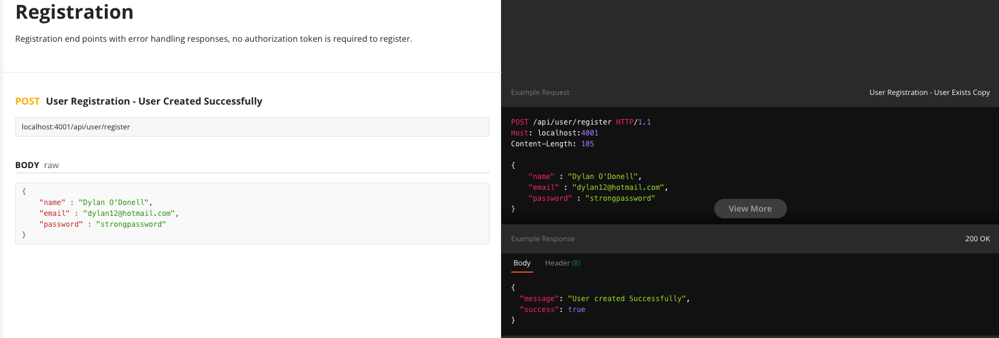

# T3A2-B - Full Stack App - Part B


### Erkan Kaban (Student ID - 12980)
### Kamran Ozturk (Student ID - 13013)
### Adam Tunchay (Student ID - 13537)


### WDA2022-02

<br>

---

# Links

## Medi-Life Clinic Server

### Deployed Site

### [Medi-Life Clinic](https://silver-lebkuchen-3068d2.netlify.app/)

### [Medi-Life Clinic Server](https://medi-life-clinic.herokuapp.com/)

<hr>

### Github Repositories

### [Medi-Life Clinic Server](https://github.com/Medi-Life-Clinic/server)

### [Medi-Life Clinic Client](https://github.com/Medi-Life-Clinic/client)

### [Part A - Documentation](https://github.com/Medi-Life-Clinic/documentation)


<hr >

## Installation

1. Clone the repository

```bash
git clone git@github.com:Medi-Life-Clinic/server.git
```

2. Install dependencies

```bash
npm i
```

3. Using the submission zip file, find the .env file and place it in the root directory of the project

4. Start the server

```bash
npm run start
```

5. The server will be running on port 4001 by default, you can change this in the .env file if it clashes with your local environment

<br>
<hr>

## Seed Database

1. To seed the database if needed, run the following command

```bash
npm run seed
```

<hr>

## Test Users

### Admin

```bash
email: admin@medi-life.com
password: 123456
```
The admin account will take you to the admin portal which will give you CRUD operations over various features within the application.

### User Account
    
```bash
email: mike@hotmail.com
password: 123456
```

This user has seeded appointments for you to test the application.

When first loading into the website you have the option of registering your own user account. Feel free to register to test the application and book your own appointments.

<br>
<hr>

## Development Testing and Documentation

Please navigate to the follow link for the full endpoint documentation showing testing throughout the development process (Example below) -  [Medi-life Clinic Server](https://documenter.getpostman.com/view/23778116/2s935mrQGj)



<br>
<hr>